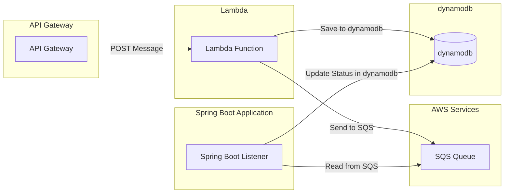

# Proyecto de Integración Lambda, SQS, DynamoDB con LocalStack y Terraform

Este proyecto permite levantar una infraestructura local que emula servicios de AWS utilizando **LocalStack** y está gestionado mediante **Terraform**. Los servicios incluyen **Lambda**, **SQS**, **API Gateway**, y **DynamoDB**. La arquitectura permite que las solicitudes lleguen a un API Gateway, invocando una función Lambda que inserta registros en una tabla DynamoDB y envía un mensaje a una cola SQS.

## Tecnologías Utilizadas

- **AWS LocalStack**: Emulación de servicios AWS.
- **API Gateway**: Punto de entrada para las solicitudes HTTP.
- **AWS Lambda**: Función que procesa las solicitudes y envía mensajes a SQS.
- **SQS (Simple Queue Service)**: Servicio de cola para mensajes.
- **MongoDB**: Base de datos NoSQL para almacenar el estado de los mensajes.
- **Spring Boot**: Aplicación que actúa como listener para la cola SQS.


## Arquitectura



## Requisitos previos

Asegúrate de tener instalados los siguientes componentes en tu máquina:
- **Docker** y **Docker Compose** (para levantar LocalStack)
- **Terraform** (para gestionar la infraestructura)
- **AWS CLI** configurada para apuntar a LocalStack
- **Java 21.**
- **Maven** instalado para compilar la aplicación Spring Boot.
- **Python y pip** para gestionar dependencias de Lambda.

## Instalación

1. Clona el repositorio en tu máquina local:
    ```bash
    git clone https://github.com/malbarracin/localstack-sqs-docker-terraform.git
    cd localstack-sqs-docker-terraform
    ```

2. Levanta **LocalStack** utilizando **Docker Compose**:
    ```bash
    docker-compose up -d
    ```

3. Inicializa **Terraform**:
    ```bash
    terraform init
    ```

4. Aplica el plan de Terraform para crear la infraestructura:
    ```bash
    terraform apply
    ```

5. Verifica que los servicios se hayan levantado correctamente. Puedes listar los recursos con los siguientes comandos:

    - Verificar las colas en SQS:
      ```bash
      aws --endpoint-url=http://localhost:4566 sqs list-queues
      ```

    - Verificar las funciones Lambda:
      ```bash
      aws --endpoint-url=http://localhost:4566 lambda list-functions
      ```

    - Verificar las tablas DynamoDB:
      ```bash
      aws --endpoint-url=http://localhost:4566 dynamodb list-tables
      ```

## Uso

### 1. Acceder a Swagger UI

   1. Abrir Swagger UI: Accede a http://localhost:8080 en tu navegador.

   2. Enviar la Solicitud:

        - Encuentra la ruta /send-message en la interfaz de Swagger UI.
        - Reemplazar **restapi_id** por el **YOUR_REST_API_ID** que obtuvimos al filalizar el script setup.sh
        - Haz clic en el botón "Try it out" (Probar).
        - Introduce el JSON en el campo de entrada.
        - Haz clic en "Execute" (Ejecutar).
        - Verificar la Respuesta: La respuesta debería mostrarse en la interfaz de Swagger UI, indicando que el mensaje fue enviado correctamente.

### 2. Enviar un mensaje a la API utilizando **Postman**

1. Abre **Postman** y crea una nueva **request** con los siguientes detalles:

   - **Method**: `POST`
   - **URL**: `http://localhost:4566/restapis/{api-id}/test/_user_request_/send-message`

   Asegúrate de reemplazar **`{api-id}`** con el ID de API Gateway que obtuviste al aplicar el plan de Terraform.

2. En la sección de **Headers**, agrega lo siguiente:

   - `Content-Type`: `application/json`

3. En el **Body**, selecciona la opción **raw** y usa **JSON** para enviar la siguiente carga de ejemplo:

   ```json
   {
     "message": "Este es un mensaje de prueba desde Postman"
   }

4. Haz clic en **Send** para enviar la solicitud.

5. Ejemplo de respuesta esperada:

   ```json
   {
    "message": "Message sent to SQS and DynamoDB record created",
    "sqs_response": {
        "MD5OfMessageBody": "96592fb4e97c1875ca47a56c58524b61",
        "MessageId": "dc55049b-b91f-43d4-870b-6d367f6e80d9",
        "SequenceNumber": "14825477513739763712",
        "ResponseMetadata": {
            "RequestId": "2c7b065f-7b76-4787-b721-fc1e0459c44c",
            "HTTPStatusCode": 200,
            "HTTPHeaders": {
                "server": "TwistedWeb/24.3.0",
                "date": "Mon, 09 Sep 2024 20:12:16 GMT",
                "content-type": "application/x-amz-json-1.0",
                "content-length": "151",
                "x-amzn-requestid": "2c7b065f-7b76-4787-b721-fc1e0459c44c"
            },
            "RetryAttempts": 0
        }
    },
    "dynamodb_record_id": "55a92d26-e3f1-447d-bbde-1e2f6a0242c3"
    }

### 3. Consultar los registros en **DynamoDB**

- Para ver los registros almacenados en DynamoDB, utiliza el siguiente comando:
    ```bash
    aws --endpoint-url=http://localhost:4566 dynamodb scan --table-name messages
    ```
### 4. Consultar los registros en **DynamoDB**

- Para ver los mensajes que fueron enviados a la cola SQS, ejecuta:
    ```bash
    aws --endpoint-url=http://localhost:4566 sqs receive-message --queue-url http://localhost:4566/000000000000/message-to-sqs.fifo
    ```      

### 5. Cierre del entorno

- Detén y elimina los contenedores de Docker:
    ```bash
    docker-compose down
    ```

- Elimina los recursos creados por Terraform:
    ```bash
    terraform destroy
    ```

### 6. Configurar y ejecutar la aplicación Spring Boot

1. En el archivo application.yml de la aplicación Spring Boot, asegúrate de que la configuración para AWS esté correcta, apuntando a los servicios levantados en LocalStack.

        Dockerfile
        server:
            port: ${PORT:8089}
                
            spring:
            cloud:
                aws:
                region:
                    static: ${DEFAULT_REGION:us-east-1}  
                credentials:
                    accessKey: ${AWS_ACCESS_KEY_ID:test}
                    secretKey: ${AWS_SECRET_ACCESS_KEY:test}
            profiles:
                active: localstack # o 'aws' dependiendo del entorno      
                    
            #Configuración de AWS y nombre de la cola
            custom:
            aws:
                sqsOrders: ${SQS_ORDERS:mi_cola}
                
            logging:
            level:
                root: info
2. Luego, compila y ejecuta la aplicación:
    -   ``` mvn clean install ```  
    -   ``` mvn spring-boot:run ```

## ¿Te gusta el contenido que comparto? Invítame un café para ayudarme a seguir creando. ¡Gracias por tu apoyo!
[](https://buymeacoffee.com/malbarracin)    